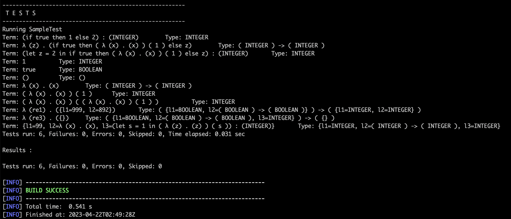

# Jatai

## Introduction
* Jatai is a prototype that incorporates some simple types, bidirectional typing, and subtyping.
* No parser needed: no need to pre-process the written program into a structured representation such as ASTs because the
  structure of a term is embedded in class definitions thanks to the OOP design of Java. Declared terms are
  guaranteed to be syntactically correct but may not be semantically correct.
* Currently, Jatai does not allow duplicate names or support auto-conversion of duplicate names.

## Set up
Follow the CL commands below to build the Docker image and run the maven test in the interactive mode. You can modify the tests to type check new terms in the `src/test/java/SampleTest.java` file.
```bash
# build the docker image and name it as "jatai"
docker build --tag jatai .
# run the image in an interactive mode and name the container as "jataicontainer"
docker run -it --name jataicontainer jatai /bin/bash
# run the maven test 
mvn test -Dtest=SampleTest
```

A success run of tests looks like:


Notice that if the above does not work, you can still run the tests in a Java main method in the `src/main/java/Client.java` file.

## Reference
[1] David Raymond Christiansen. 2013. Bidirectional typing rules: A tutorial. (2013).

[2] Jana Dunfield and Neel Krishnaswami. 2021. Bidirectional Typing. ACM Computing Surveys (CSUR) 54, 5 (2021), 1–38.

[3] Benjamin C Pierce. 2002. Types and Programming Languages. MIT press.

[4] [A Type System in Java](https://github.com/Zambozoo/bidirectional-type-checking)
